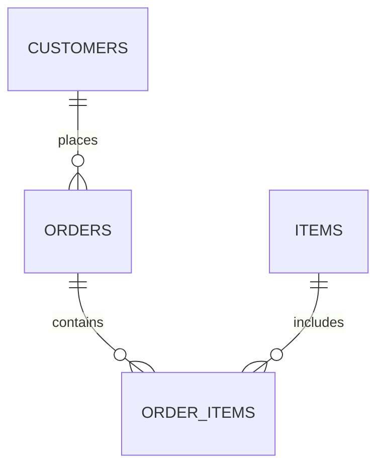

# Database Relationships

## Entity Relationship Diagram


---

### order_items Table
| order_id | item_id |
|:---------|:--------|
| 1        | 2       |
| 1        | 3       |
| 1        | 1       |
| 2        | 3       |

---

## Un-normalised Database
### Orders Table
| order_id | customer_id | items |
|:---------|:------------|:------|
| 1        | 101         | 2,3   |
| 2        | 102         | 1,3   |

The items column contains a list of items. This is not allowed and therefore requires normalisation.

---

## First Normal Form
##### Orders Table
| order_id | customer_id |
|:---------|:------------|
| 1        | 101         |
| 2        | 102         |

##### Order Items Table
| order_id | item_id |
|:---------|:--------|
| 1        | 2       |
| 1        | 4       |
| 2        | 1       |
| 2        | 2       |

By adding the order_items table, we remove the need for the items list.

---

## Second Normal Form
2NF requires each non-key attribute (ie name) to depend on the primary key.

For example, the item_name should be dependant on the item_id and should therefore not be included within the order_items table.

``` sql
Table order_items {
  order_id int
  item_id int
  item_name varchar
}
```

To fix this, ensure that the ```item_name``` attribute is held within the items table, and the order_items table only contains the primary keys it requires.

``` sql
Table items {
  id integer [primary key]
  name varchar
  price double
}

Table order_items {
  id integer [primary key]
  order_id int
  item_id int
}
```

---

## Third Normal Form
3NF ensures that there are no non-key attributes that depends on other non-key other attributes.
For example, if the customers table contained fname, lname *and* fullname, the fullname would be a trasitive dependancy.

```sql
Table customers {
  id integer [primary key]
  fname varchar
  lname varchar
  fullname varchar
}
```
Fixing this is as simple as removing the fullname attribute.

```sql
Table customers {
  id integer [primary key]
  fname varchar
  lname varchar
}
```

---

## Starting database
``` sql
Table customers {
  id integer [primary key]
  fname varchar
  lname varchar
  created_at timestamp
}

Table items {
  id integer [primary key]
  name varchar
  price double
}

Table orders {
  id integer [primary key]
  customer_id int [ref: > customers.id]  
}

Table order_items {
  id integer [primary key]
  order_id int [ref: > orders.id]
  item_id int [ref: > items.id]
}
```

## Final Database 

``` sql
Table customers {
  id integer [primary key]
  fname varchar [not null]
  lname varchar [not null]
  email varchar [not null, unique]
  created_at timestamp [default: `now()`]
  last_updated timestamp [default: `now()`]
}

Table items {
  id integer [primary key]
  name varchar [not null, unique]
  price double [not null]
  quantity integer [default: 0, not null]
  created_at timestamp [default: `now()`]
  last_updated timestamp [default: `now()`]
}

Table orders {
  id integer [primary key]
  customer_id int [not null, ref: > customers.id] // on delete: cascade
  created_at timestamp [default: `now()`]
}

Table order_items {
  id integer [primary key]
  order_id int [not null, ref: > orders.id] // on delete: cascade
  item_id int [not null, ref: > items.id] // on delete: cascade
  quantity integer [default: 1, not null]
  item_price_at_order double [not null]
}
```


---

*This document uses DBML syntax*